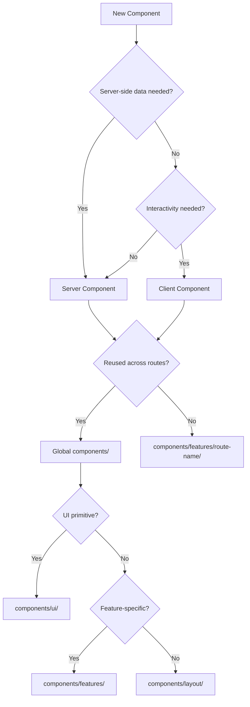

# 🧭 Next.js 15 Component Structure Guidelines

A comprehensive guide for organizing components in Next.js 15 App Router following modern best practices, performance optimization, and maintainable architecture patterns.

---

## 🏗️ **Component Organization Strategy**

### **1. Server Components First (Default)**

```tsx
// ✅ Default to Server Components
export default async function ProductPage() {
  const products = await fetchProducts() // Server-side data fetching
  return <ProductGrid products={products} />
}
```

### **2. Client Components Only When Needed**

```tsx
// ✅ Use 'use client' only for interactivity
'use client'
export function InteractiveForm() {
  const [state, setState] = useState('')
  return <form>...</form>
}
```

---

## 📁 **Directory Structure**

### **Root Level Organization**

```
app/                           # Next.js App Router
├── layout.tsx                # Root layout with providers
├── page.tsx                  # Home page (ISR)
├── globals.css               # Global styles + theme tokens
├── loading.tsx               # Global loading UI
├── error.tsx                 # Global error boundary
├── vehicles/                 # Vehicle listing route
│   ├── page.tsx              # Vehicle listing page
│   ├── loading.tsx           # Route-specific loading
│   └── error.tsx             # Route-specific error
├── vehicles/[id]/            # Vehicle detail route
│   ├── page.tsx              # Individual vehicle page
│   ├── loading.tsx           # Route-specific loading
│   └── error.tsx             # Route-specific error
└── checkout/                 # Checkout route
    ├── page.tsx              # Checkout page
    ├── loading.tsx           # Route-specific loading
    └── error.tsx             # Route-specific error
```

components/ # Global reusable components
├── providers/ # Context providers
│ ├── TenantProvider.tsx
│ └── ThemeProvider.tsx
├── ui/ # shadcn/ui components
│ ├── button.tsx
│ ├── card.tsx
│ └── input.tsx
├── forms/ # Form components
│ ├── LoginForm.tsx
│ └── BookingForm.tsx
├── layout/ # Layout components
│ ├── Header.tsx
│ ├── Footer.tsx
│ └── Navigation.tsx
└── features/ # Feature-specific components
├── auth/
│ ├── LoginModal.tsx
│ └── AuthGuard.tsx
├── vehicles/
│ ├── VehicleCard.tsx
│ ├── VehicleGrid.tsx
│ ├── VehicleFilters.tsx
│ └── VehicleDetails.tsx
├── checkout/
│ ├── CheckoutForm.tsx
│ ├── PaymentForm.tsx
│ └── OrderSummary.tsx
└── home/
├── HeroSection.tsx
├── FeatureGrid.tsx
└── CallToAction.tsx

lib/ # Core library code
├── components/ # Complex reusable components
│ ├── DataTable.tsx
│ ├── SearchFilters.tsx
│ └── Pagination.tsx
├── hooks/ # Custom hooks
├── services/ # Service layer
└── utils/ # Utility functions

````

---

## 🎯 **Component Placement Rules**

### **🏗️ Why Keep All Components in `/components/`?**

**Benefits of centralized component organization:**

- ✅ **Better Discoverability**: All components in one place
- ✅ **Easier Refactoring**: No need to search multiple route folders
- ✅ **Consistent Structure**: Uniform organization across the app
- ✅ **Better Reusability**: Easier to find and reuse components
- ✅ **Cleaner Routes**: Route folders focus only on pages and routing
- ✅ **Simpler Imports**: Consistent import paths from `/components/`

### **✅ Route-Specific Components (`components/features/route-name/`)**

**Use for components that are:**

- **Primarily used within a specific route/feature**
- **Tightly coupled to route data/context**
- **Feature-specific UI patterns**

**Examples:**
- `components/features/home/HeroSection.tsx`
- `components/features/vehicles/VehicleCard.tsx`
- `components/features/checkout/CheckoutForm.tsx`

```tsx
// components/features/home/HeroSection.tsx
export default function HeroSection() {
  return (
    <section className="hero">
      <h1>Welcome to Our Vehicle Rental</h1>
      <p>Find the perfect vehicle for your journey</p>
    </section>
  )
}

// components/features/vehicles/VehicleCard.tsx
export default function VehicleCard({ vehicle }) {
  return (
    <Card>
      <CardHeader>
        <CardTitle>{vehicle.name}</CardTitle>
      </CardHeader>
      <CardContent>
        <VehicleInfo vehicle={vehicle} />
      </CardContent>
    </Card>
  )
}
````

### **✅ Global UI Components (`components/ui/`)**

**Use for:**

- **shadcn/ui components**
- **Design system elements**
- **Basic UI primitives**

```tsx
// components/ui/Button.tsx
import { Button as ShadcnButton } from '@/components/ui/button'

export function Button({ variant = 'default', ...props }) {
  return <ShadcnButton variant={variant} {...props} />
}
```

### **✅ Feature Components (`components/features/`)**

**Use for:**

- **Domain-specific reusable components**
- **Complex business logic components**
- **Feature-specific UI patterns**

```tsx
// components/features/booking/BookingCard.tsx
export function BookingCard({ booking }) {
  return (
    <Card>
      <CardHeader>
        <CardTitle>{booking.vehicle.name}</CardTitle>
      </CardHeader>
      <CardContent>
        <BookingDetails booking={booking} />
      </CardContent>
    </Card>
  )
}
```

### **✅ Layout Components (`components/layout/`)**

**Use for:**

- **Page structure components**
- **Navigation elements**
- **Global layout patterns**

```tsx
// components/layout/Header.tsx
export function Header() {
  return (
    <header className='border-b'>
      <nav className='container mx-auto px-4 py-4'>
        <Logo />
        <Navigation />
        <UserMenu />
      </nav>
    </header>
  )
}
```

### **✅ Complex Library Components (`lib/components/`)**

**Use for:**

- **Advanced reusable components**
- **Data-heavy components**
- **Complex business logic**

```tsx
// lib/components/DataTable.tsx
export function DataTable({ data, columns, pagination }) {
  // Complex table logic with sorting, filtering, pagination
  return <Table>...</Table>
}
```

---

## 🚀 **Performance Optimization**

### **1. Server Components by Default**

```tsx
// ✅ Server Component (default)
export default async function VehiclePage() {
  const vehicles = await fetchVehicles() // Server-side data fetching
  return <VehicleGrid vehicles={vehicles} />
}
```

### **2. Client Components for Interactivity**

```tsx
// ✅ Client Component only when needed
'use client'
export function VehicleFilter() {
  const [filters, setFilters] = useState({})
  return <FilterForm filters={filters} onChange={setFilters} />
}
```

### **3. Code Splitting with Dynamic Imports**

```tsx
// ✅ Lazy load heavy components
import dynamic from 'next/dynamic'

const HeavyChart = dynamic(() => import('./HeavyChart'), {
  loading: () => <ChartSkeleton />,
  ssr: false,
})
```

---

## 🎨 **Component Patterns**

### **1. Server Component with Client Islands**

```tsx
// ✅ Server component with client interactivity
export default async function VehiclePage() {
  const vehicles = await fetchVehicles() // Server-side data

  return (
    <div>
      <VehicleGrid vehicles={vehicles} /> {/* Server component */}
      <VehicleFilter /> {/* Client component for interactivity */}
    </div>
  )
}
```

### **2. Hybrid Components**

```tsx
// ✅ Server component with client wrapper
export default function VehicleCard({ vehicle }) {
  return (
    <Card>
      <CardHeader>
        <CardTitle>{vehicle.name}</CardTitle>
      </CardHeader>
      <CardContent>
        <VehicleImage vehicle={vehicle} />
        <ClientBookNow vehicleId={vehicle.id} /> {/* Client component */}
      </CardContent>
    </Card>
  )
}
```

### **3. Provider Pattern**

```tsx
// ✅ Context providers in layout
export default function RootLayout({ children }) {
  return (
    <html>
      <body>
        <Providers>
          <TenantProvider>
            <ThemeProvider>{children}</ThemeProvider>
          </TenantProvider>
        </Providers>
      </body>
    </html>
  )
}
```

---

## 🔧 **Best Practices**

### **1. Component Naming**

```tsx
// ✅ Descriptive, intention-revealing names
export function VehicleCard() {} // Good
export function CheckoutForm() {} // Good
export function Component1() {} // Bad
```

### **2. File Organization**

```tsx
// ✅ Group related components
components / features / vehicles / VehicleCard.tsx
VehicleGrid.tsx
VehicleFilters.tsx
index.ts // Export all
```

### **3. Export Patterns**

```tsx
// ✅ Clean exports
// components/features/vehicles/index.ts
export { VehicleCard } from './VehicleCard'
export { VehicleGrid } from './VehicleGrid'
export { VehicleFilters } from './VehicleFilters'
```

### **4. Event Handler Functions**

````tsx
// ✅ Use named handler functions for better readability, debugging, and performance
export function AddonsSection({ onAddonChange, onQuantityChange }: AddonsSectionProps) {
  // Create a factory function that returns the handler with closure over addon context
  const handleValueChange = (addonId: string, isSelected: boolean, currentQuantity: number) => (value: string) => {
    const quantity = parseInt(value)
    if (quantity === 0) {
      onAddonChange(addonId, false)
    } else {
      if (!isSelected) {
        onAddonChange(addonId, true)
      }
      onQuantityChange(addonId, quantity)
    }
  }

  return (
    <Select
      value={isSelected ? currentQuantity.toString() : '0'}
      onValueChange={handleValueChange(addon.id, isSelected, currentQuantity)}
    >
      {/* Select content */}
    </Select>
  )
}

// ✅ Simple handlers for direct events
const handleSubmit = (e: React.FormEvent) => {
  e.preventDefault()
  // Handle form submission
}

const handleInputChange = (value: string) => {
  // Handle input change
}

return (
  <form onSubmit={handleSubmit}>
    <Input onChange={handleInputChange} />
    <Button type="submit">Submit</Button>
  </form>
)

// ❌ Avoid anonymous functions in JSX - causes unnecessary re-renders
<Select onValueChange={(value: string) => { /* logic */ }} />
<Button onClick={() => onBookNow?.(vehicle.id)}>Book Now</Button>
<form onSubmit={(e) => { e.preventDefault(); /* logic */ }}>
  <Input onChange={(value) => { /* logic */ }} />
</form>

### **5. Form Control Event Handlers**

```tsx
// ✅ Good: Use proper event handlers for form controls
export function AddonsSection({ onAddonChange, onQuantityChange }: AddonsSectionProps) {
  const handleCheckboxChange = useCallback(
    (addonId: string) => (checked: boolean | string) => {
      onAddonChange(addonId, !!checked)
    },
    [onAddonChange]
  )

  const handleSelectChange = useCallback(
    (addonId: string) => (value: string) => {
      const quantity = parseInt(value)
      if (quantity === 0) {
        onAddonChange(addonId, false)
      } else {
        onAddonChange(addonId, true)
        onQuantityChange(addonId, quantity)
      }
    },
    [onAddonChange, onQuantityChange]
  )

  return (
    <>
      <Checkbox
        id={addon.id}
        checked={isSelected}
        onCheckedChange={handleCheckboxChange(addon.id)}
      />
      <Select
        value={isSelected ? currentQuantity.toString() : '0'}
        onValueChange={handleSelectChange(addon.id)}
      />
    </>
  )
}

// ❌ Bad: Don't add unnecessary onClick handlers to form controls
<Checkbox onClick={e => e.stopPropagation()} />  // Unnecessary
<Input onClick={e => e.stopPropagation()} />     // Unnecessary
<Select onClick={e => e.stopPropagation()} />    // Unnecessary

// ❌ Bad: Don't use anonymous functions for form events
<Checkbox onCheckedChange={checked => onAddonChange(addon.id, !!checked)} />
<Select onValueChange={value => handleValueChange(addon.id, value)} />
````

### **4. Type Safety**

```tsx
// ✅ Full TypeScript support
interface VehicleCardProps {
  vehicle: Vehicle
  onBookNow?: (vehicleId: string) => void
  variant?: 'default' | 'compact'
}

export function VehicleCard({
  vehicle,
  onBookNow,
  variant = 'default',
}: VehicleCardProps) {
  // Component implementation
}
```

### **5. Event Handler Functions**

```tsx
// ✅ Use named handler functions instead of anonymous functions
export function VehicleCard({ vehicle, onBookNow }: VehicleCardProps) {
  const handleBookNow = () => {
    onBookNow?.(vehicle.id)
  }

  const handleImageClick = () => {
    // Handle image click logic
  }

  return (
    <Card>
      <CardHeader>
        <CardTitle>{vehicle.name}</CardTitle>
      </CardHeader>
      <CardContent>
        <Image
          onClick={handleImageClick}
          src={vehicle.image}
          alt={vehicle.name}
        />
        <Button onClick={handleBookNow}>Book Now</Button>
      </CardContent>
    </Card>
  )
}

// ❌ Avoid anonymous functions in JSX
;<Button onClick={() => onBookNow?.(vehicle.id)}>Book Now</Button>
```

---

## 🚫 **Anti-Patterns to Avoid**

| ❌ **Don't Do This**                   | ✅ **Do This Instead**                                     |
| -------------------------------------- | ---------------------------------------------------------- |
| Scattering components in route folders | Keep all components in `/components/` organized by purpose |
| Use client components unnecessarily    | Start with server components                               |
| Create deep component nesting          | Flatten and group logically                                |
| Mix concerns in single components      | Separate data, logic, and presentation                     |
| Use generic component names            | Use descriptive, specific names                            |
| Skip TypeScript interfaces             | Define proper prop interfaces                              |

---

## 🎯 **Decision Flow**



---

## 📋 **Quick Reference**

### **Component Placement Checklist**

- [ ] **Server Component by default**
- [ ] **Client Component only for interactivity**
- [ ] **Route-specific → `components/features/route-name/`**
- [ ] **UI primitives → `components/ui/`**
- [ ] **Feature-specific → `components/features/`**
- [ ] **Layout elements → `components/layout/`**
- [ ] **Complex reusable → `lib/components/`**

### **Performance Checklist**

- [ ] **Server-side data fetching**
- [ ] **Code splitting for heavy components**
- [ ] **Proper loading and error boundaries**
- [ ] **Optimized bundle size**

### **Quality Checklist**

- [ ] **TypeScript interfaces defined**
- [ ] **Descriptive component names**
- [ ] **Proper error handling**
- [ ] **Accessibility attributes**
- [ ] **Responsive design**

---

## 🚀 **Migration Guide**

### **From Pages Router**

```tsx
// Before (Pages Router)
// pages/vehicles/[id].tsx
export default function VehiclePage({ vehicle }) {
  return <VehicleDetail vehicle={vehicle} />
}

// After (App Router)
// app/vehicles/[id]/page.tsx
export default async function VehiclePage({ params }) {
  const vehicle = await fetchVehicle(params.id)
  return <VehicleDetail vehicle={vehicle} />
}
```

### **From Client-Side Data Fetching**

```tsx
// Before
'use client'
export default function VehiclePage() {
  const [vehicles, setVehicles] = useState([])
  useEffect(() => {
    fetch('/api/vehicles')
      .then(res => res.json())
      .then(setVehicles)
  }, [])
  return <VehicleGrid vehicles={vehicles} />
}

// After
export default async function VehiclePage() {
  const vehicles = await fetchVehicles() // Server-side
  return <VehicleGrid vehicles={vehicles} />
}
```

---

This guide ensures your Next.js 15 application follows modern best practices, optimizes performance, and maintains clean, scalable architecture! 🎉
