# Architecture Overview

## System Architecture

This multi-tenant storefront is built with **Next.js 15**, **Tailwind CSS v4**, and **shadcn/ui**, featuring a sophisticated theme system and optimized rendering strategies.

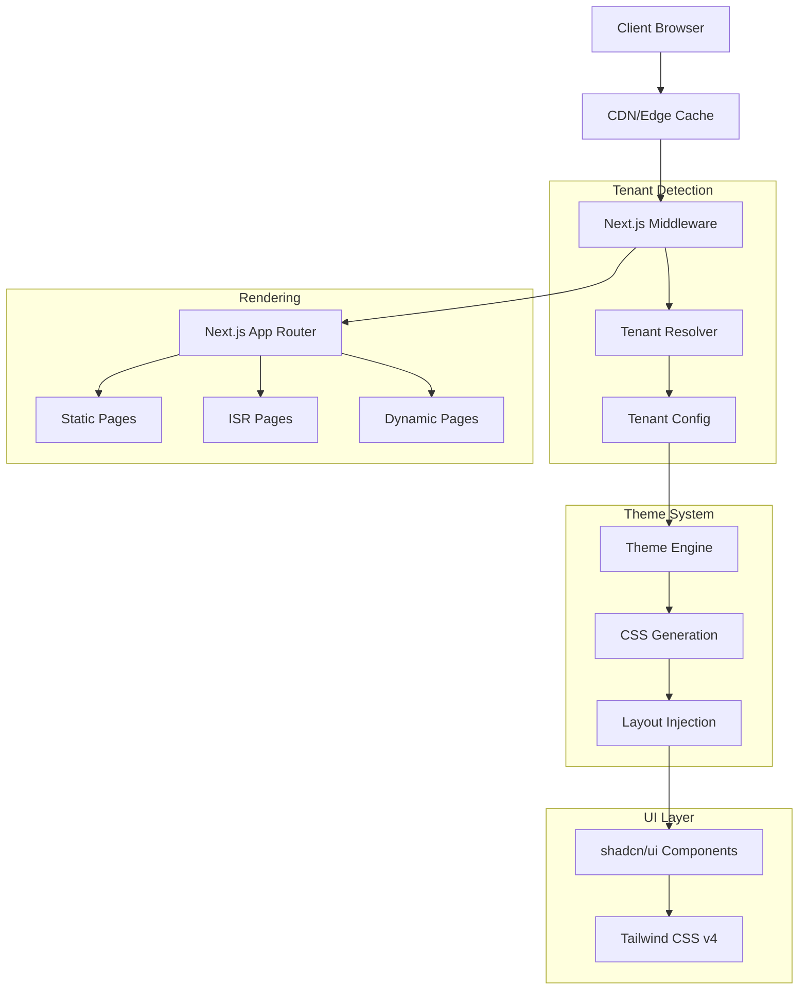

## Core Components

### 1. Multi-Tenancy System

#### Tenant Detection Flow

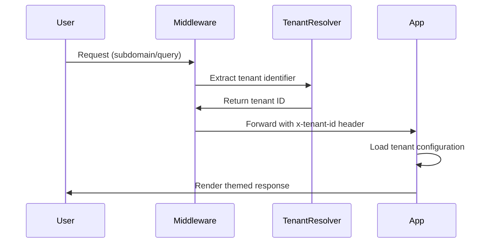

#### File Structure

```
config/
├── tenants.json                 # Tenant registry
└── tenants/
    ├── abc-rental.json          # Fire theme tenant
    ├── xyz-rental.json          # Forest theme tenant
    └── default.json             # Ocean theme default

lib/
├── tenant.ts                    # Tenant utilities
├── tenant-utils.ts             # Helper functions
└── types/
    └── tenant.ts               # TypeScript interfaces
```

### 2. Theme System Architecture

#### Theme Flow

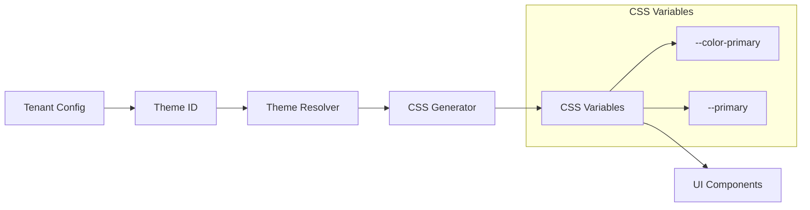

#### Implementation Structure

```
lib/themes/
├── index.ts                     # Main exports
├── themes.ts                    # Theme definitions
└── generator.ts                 # CSS generation

components/providers/
├── ThemeProvider.tsx            # Client-side context
└── TenantProvider.tsx          # Tenant context
```

### 3. Rendering Strategy Architecture

#### Page-Level Rendering Decisions

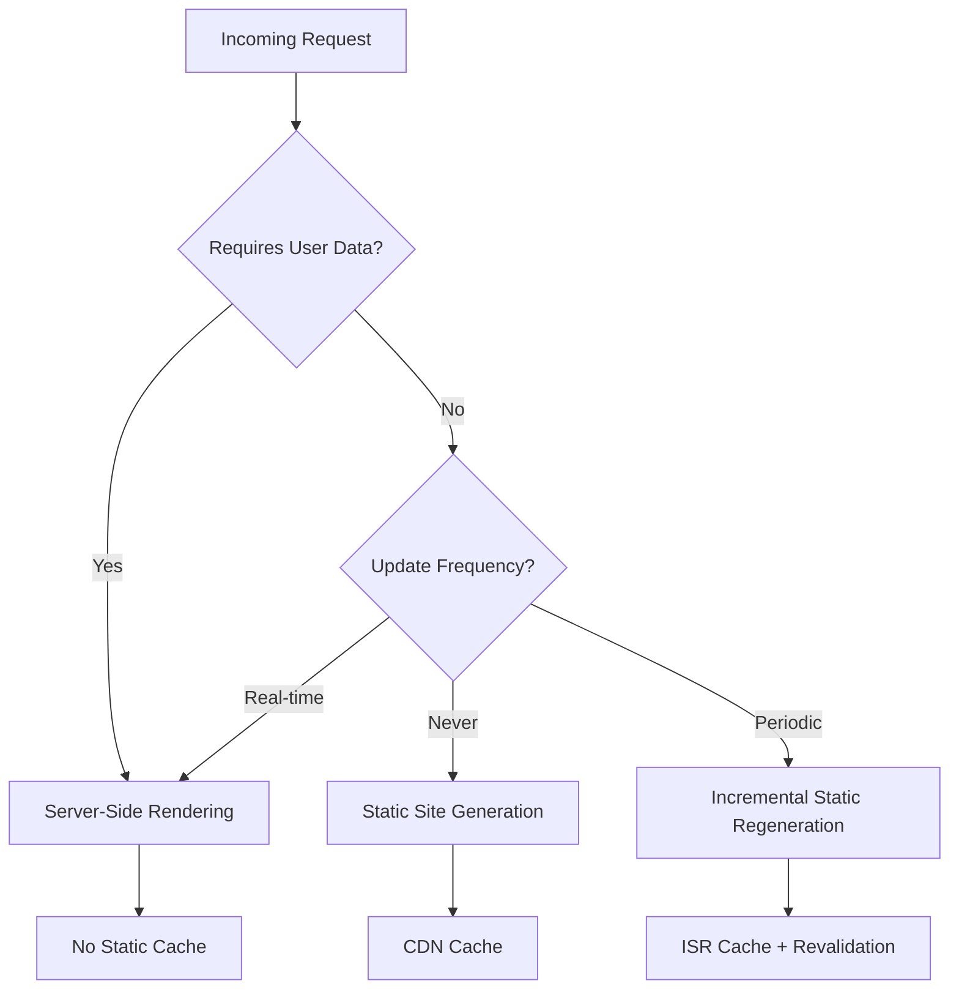

#### Current Implementation

| Route Pattern     | Strategy  | Reason                               |
| ----------------- | --------- | ------------------------------------ |
| `/`               | ISR (1hr) | Tenant content, updates occasionally |
| `/about`          | SSG       | Static content, rarely changes       |
| `/dashboard`      | SSR       | User-specific, real-time             |
| `/api/revalidate` | SSR       | Dynamic API endpoint                 |

### 4. Component Architecture

#### UI Component Hierarchy

```mermaid
graph TB
    App[App Layout] --> Providers[Providers]
    Providers --> TenantProvider
    Providers --> ThemeProvider

    ThemeProvider --> Pages[Page Components]
    Pages --> ShadcnUI[shadcn/ui Components]
    Pages --> Custom[Custom Components]

    subgraph "shadcn/ui"
        ShadcnUI --> Button
        ShadcnUI --> Card
        ShadcnUI --> Input
        ShadcnUI --> Badge
    end

    subgraph "Custom"
        Custom --> ActionButtons
        Custom --> HeroSection
        Custom --> ThemeDemo
    end
```

#### Component Data Flow

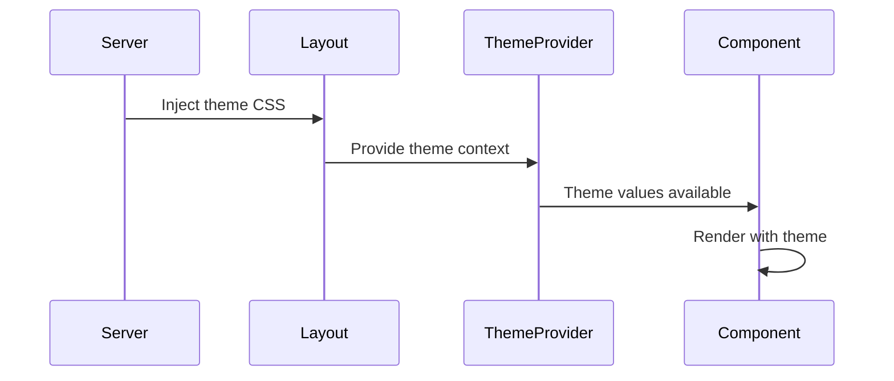

## Technology Stack

### Core Technologies

| Technology       | Version | Purpose                    |
| ---------------- | ------- | -------------------------- |
| **Next.js**      | 15.4.6  | Full-stack React framework |
| **React**        | 18+     | UI library                 |
| **TypeScript**   | Latest  | Type safety                |
| **Tailwind CSS** | v4      | Utility-first CSS          |
| **shadcn/ui**    | Latest  | Component library          |

### Development Tools

| Tool         | Purpose         |
| ------------ | --------------- |
| **ESLint**   | Code linting    |
| **Prettier** | Code formatting |
| **Husky**    | Git hooks       |

## Performance Architecture

### Caching Strategy

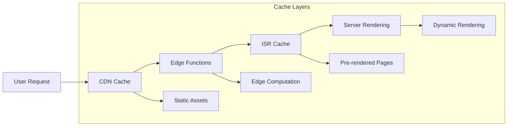

### Build Optimization

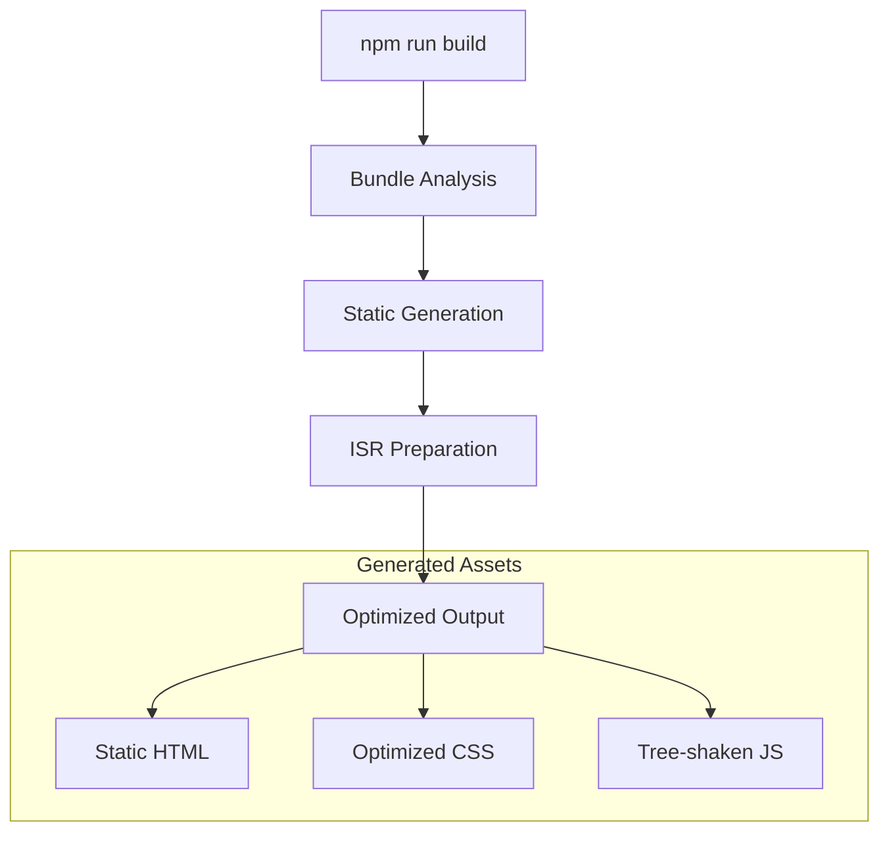

## Security Architecture

### Tenant Isolation

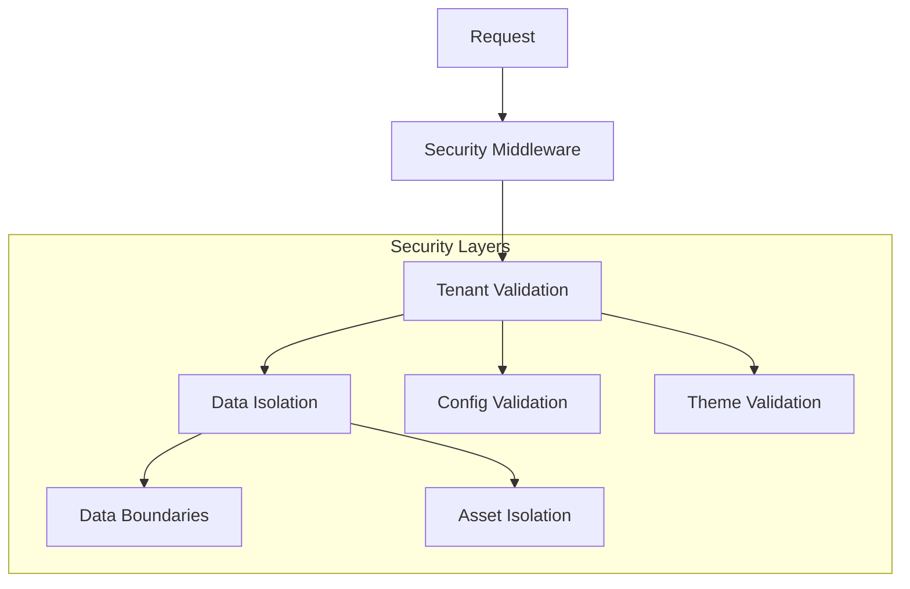

### Configuration Security

- **Tenant configs** are validated server-side
- **Theme properties** are sanitized and validated
- **API endpoints** include secret-based authentication
- **Headers** are properly sanitized in middleware

## Deployment Architecture

### Production Flow

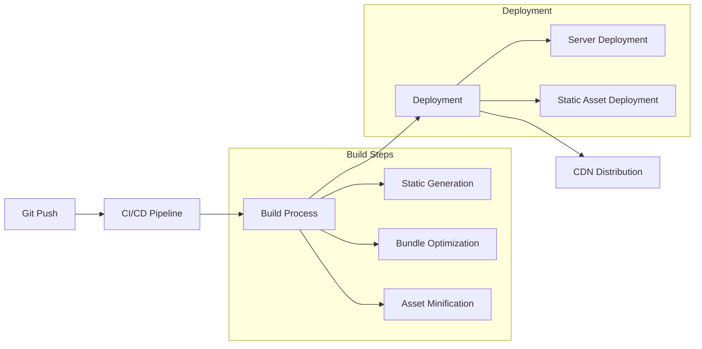

### Environment Configuration

```bash
# Production
NEXT_PUBLIC_APP_URL=https://your-domain.com
REVALIDATION_SECRET=your-secret-key

# Development
NEXT_PUBLIC_APP_URL=http://localhost:3001
REVALIDATION_SECRET=dev-secret
```

## Data Flow

### Request Lifecycle

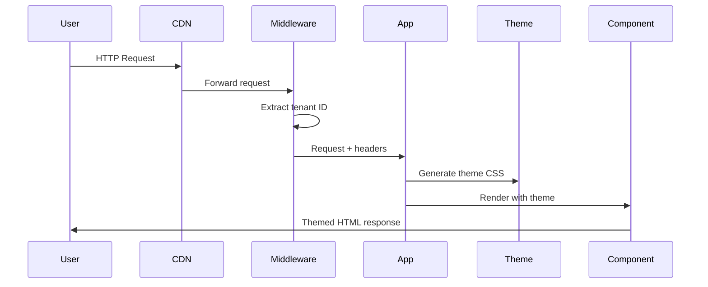

### Theme Application Flow

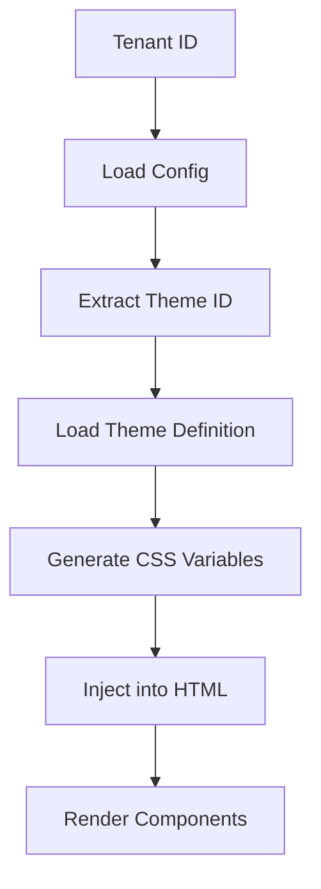

## Scalability Considerations

### Horizontal Scaling

- **Stateless architecture** enables multiple server instances
- **CDN caching** reduces server load
- **ISR** provides performance with freshness
- **Component-level caching** optimizes rendering

### Performance Optimizations

1. **Theme CSS** is generated server-side and cached
2. **Static assets** are optimized and CDN-distributed
3. **JavaScript bundles** are tree-shaken and code-split
4. **Images** are optimized with Next.js Image component

### Monitoring Points

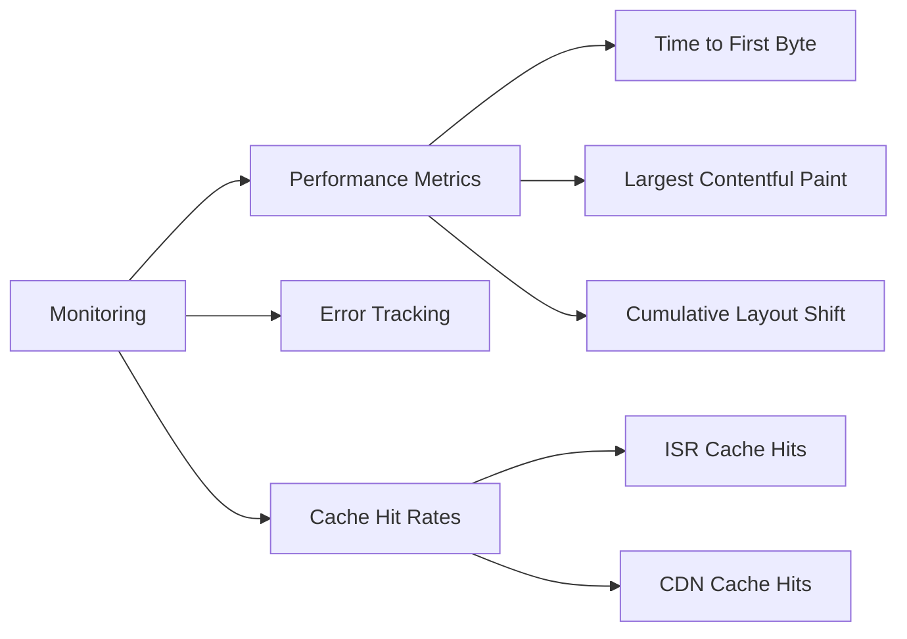

## Development Workflow

### Local Development

```bash
# 1. Start development server
npm run dev

# 2. Access tenants
http://localhost:3001                    # Default (Ocean)
http://abc-rental.localhost:3001         # Fire theme
http://xyz-rental.localhost:3001         # Forest theme

# 3. Test theme switching
curl "http://localhost:3001/?tenant=abc-rental"
```

### Testing Strategy

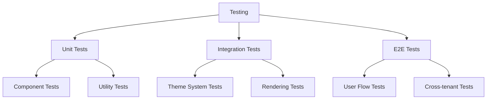

## File Structure Overview

```
storefront/
├── app/
│   ├── layout.tsx                # Root layout with theme injection
│   ├── page.tsx                 # Main tenant page (ISR)
│   ├── globals.css              # Global styles + shadcn/ui
│   └── api/
│       └── revalidate/          # ISR revalidation endpoint
├── components/
│   ├── providers/               # Context providers
│   └── ui/                      # UI components
├── config/
│   ├── tenants.json            # Tenant registry
│   └── tenants/                # Individual tenant configs
├── lib/
│   ├── themes/                 # Theme system
│   ├── types/                  # TypeScript definitions
│   └── utils/                  # Utility functions
├── middleware.ts               # Tenant detection
└── next.config.js             # Next.js configuration
```

## Migration Path

### From Legacy Systems

1. **Assessment**: Evaluate current architecture
2. **Planning**: Design migration strategy
3. **Implementation**:
   - Start with theme system
   - Add shadcn/ui components
   - Implement rendering strategies
4. **Testing**: Comprehensive testing across tenants
5. **Deployment**: Gradual rollout with monitoring

### Upgrade Path

1. **Next.js updates**: Follow Next.js upgrade guides
2. **Tailwind CSS**: Migrate to v4 features gradually
3. **shadcn/ui**: Keep components updated
4. **Theme system**: Add new themes as needed

This architecture provides a solid foundation for a scalable, performant, and maintainable multi-tenant storefront application.
