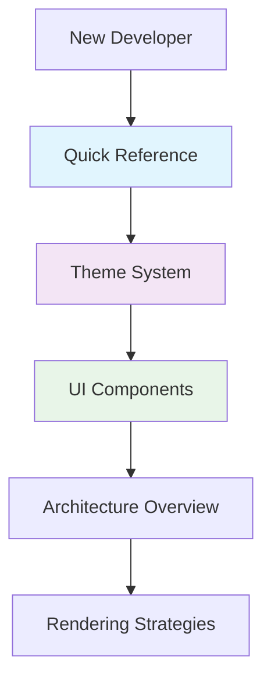
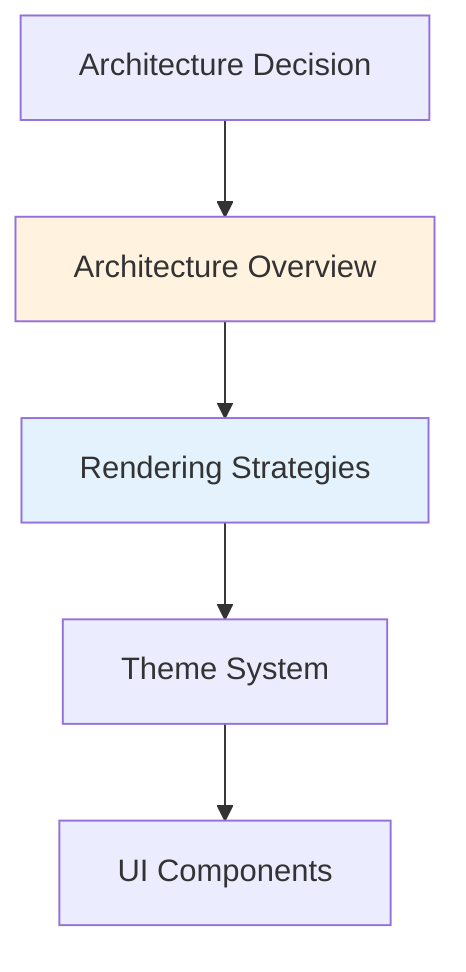
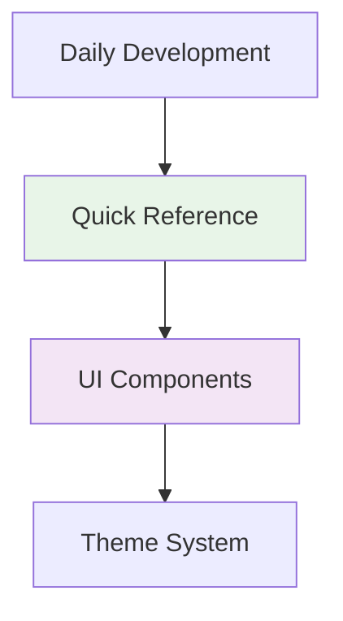

# Documentation Index

Welcome to the comprehensive documentation for the Multi-Tenant Storefront. This documentation is organized to help developers at different stages of their journey with the project.

## 📚 Documentation Structure

### 🚀 **For New Developers**

Start here if you're new to the project or need to get up and running quickly:

1. **[⚡ Quick Reference](./QUICK-REFERENCE.md)** - **START HERE** for immediate setup and daily development
2. **[🎨 Theme System](./THEME-SYSTEM.md)** - Complete guide to the theming system
3. **[🧩 UI Components](./UI-COMPONENTS.md)** - shadcn/ui component usage and patterns

### 🏗️ **For Architecture Decisions**

Use these guides when making technical decisions or understanding system design:

1. **[🏛️ Architecture Overview](./ARCHITECTURE-OVERVIEW.md)** - High-level system architecture and design
2. **[⚡ Rendering Strategies](./RENDERING-STRATEGIES.md)** - SSG/ISR/SSR decision guide

### 🔧 **For Daily Development**

Keep these bookmarked for regular reference:

- **[⚡ Quick Reference](./QUICK-REFERENCE.md)** - Developer cheat sheet
- **[🎨 Theme System](./THEME-SYSTEM.md)** - Theme examples and patterns
- **[🧩 UI Components](./UI-COMPONENTS.md)** - Component usage examples

## 📖 **Documentation Guide**

### **New Developer Path**



### **Architecture Decision Path**



### **Daily Development Path**



## 🎯 **Quick Navigation**

### **Essential Commands**

```bash
# Development
npm run dev                    # Start development server
npm run build                 # Production build
npm run lint                  # Run ESLint

# Testing Tenants
curl "http://localhost:3001"                    # Ocean theme
curl "http://abc-rental.localhost:3001"         # Fire theme
curl "http://xyz-rental.localhost:3001"         # Forest theme
```

### **Key Files**

```
docs/
├── README.md                 # This file - documentation index
├── QUICK-REFERENCE.md        # ⚡ Start here for new developers
├── THEME-SYSTEM.md           # 🎨 Complete theming guide
├── UI-COMPONENTS.md          # 🧩 shadcn/ui component usage
├── ARCHITECTURE-OVERVIEW.md  # 🏛️ System architecture
├── RENDERING-STRATEGIES.md   # ⚡ SSG/ISR/SSR guide
├── [Legacy Documentation]    # 📚 Additional existing docs
│   ├── project-structure.md  # Project structure details
│   ├── development-*.md      # Development guides
│   ├── services-*.md         # Service layer docs
│   ├── zustand-*.md          # State management docs
│   └── ui-*.md               # UI implementation docs
```

### **Common Tasks**

| Task                      | Documentation                                     | Section               |
| ------------------------- | ------------------------------------------------- | --------------------- |
| Add new tenant            | [Quick Reference](./QUICK-REFERENCE.md)           | Adding New Tenants    |
| Add new theme             | [Theme System](./THEME-SYSTEM.md)                 | Adding New Themes     |
| Choose rendering strategy | [Rendering Strategies](./RENDERING-STRATEGIES.md) | Quick Decision Matrix |
| Debug theme issues        | [Quick Reference](./QUICK-REFERENCE.md)           | Troubleshooting       |
| Use shadcn/ui components  | [UI Components](./UI-COMPONENTS.md)               | Component Library     |

## 🔗 **External Resources**

### **Technology Stack**

- **[Next.js 15](https://nextjs.org/docs)** - Framework documentation
- **[shadcn/ui](https://ui.shadcn.com)** - Component library
- **[Tailwind CSS v4](https://tailwindcss.com/docs)** - Styling framework
- **[TypeScript](https://www.typescriptlang.org/docs)** - Type safety

### **Related Documentation**

- **[Project README](../README.md)** - Main project overview
- **[Development Guide](../DEVELOPMENT-TESTING.md)** - Development workflow
- **[SEO Implementation](../SEO-IMPLEMENTATION-SUMMARY.md)** - SEO setup
- **[Performance Optimization](../CSS-FIX-SUMMARY.md)** - Performance tips

### **Additional Legacy Documentation**

The docs folder also contains comprehensive legacy documentation covering:

- **Project Structure**: [project-structure.md](./project-structure.md), [project-structure-diagram.md](./project-structure-diagram.md)
- **Development**: [development-setup.md](./development-setup.md), [development-testing.md](./development-testing.md)
- **Services**: [services-overview.md](./services-overview.md), [services-auth.md](./services-auth.md), [services-base.md](./services-base.md)
- **State Management**: [state-management-zustand-plan.md](./state-management-zustand-plan.md), [zustand-implementation-guide.md](./zustand-implementation-guide.md)
- **UI Implementation**: [ui-css-fixes.md](./ui-css-fixes.md), [ui-seo-implementation.md](./ui-seo-implementation.md)

## 📝 **Documentation Standards**

### **File Naming Convention**

- Use `UPPERCASE-WITH-HYPHENS.md` format
- Include descriptive names that indicate content
- Group related concepts together

### **Content Structure**

- Start with overview and quick start
- Include practical examples and code snippets
- Provide troubleshooting sections
- Use emojis for visual organization
- Include decision matrices where helpful

### **Code Examples**

- Use TypeScript for type safety
- Include both simple and complex examples
- Show real-world usage patterns
- Provide copy-paste ready snippets

## 🤝 **Contributing to Documentation**

### **Adding New Documentation**

1. Follow the naming convention: `TOPIC-NAME.md`
2. Include a brief description in this index
3. Update the navigation paths if needed
4. Add to appropriate sections (New Developer, Architecture, Daily Development)

### **Updating Existing Documentation**

1. Maintain the existing structure and style
2. Update this index if content changes significantly
3. Ensure all links remain valid
4. Test code examples for accuracy

### **Documentation Review Process**

1. **Accuracy**: Verify all code examples work
2. **Completeness**: Ensure all topics are covered
3. **Clarity**: Check that explanations are clear
4. **Consistency**: Maintain consistent style and format

## 📊 **Documentation Metrics**

### **Coverage Areas**

- ✅ **Theme System**: Complete with examples and troubleshooting
- ✅ **UI Components**: Comprehensive shadcn/ui integration
- ✅ **Rendering Strategies**: Decision guide with implementation
- ✅ **Architecture**: System overview with diagrams
- ✅ **Quick Reference**: Daily development cheat sheet

### **Target Audience**

- 🆕 **New Developers**: Quick start and essential concepts
- 🏗️ **Architects**: System design and technical decisions
- 🔧 **Daily Developers**: Reference materials and patterns
- 🧪 **QA/Testing**: Troubleshooting and validation

---

**Need help?** Start with the [Quick Reference](./QUICK-REFERENCE.md) for immediate assistance, or dive into the specific topic documentation for detailed guidance.
