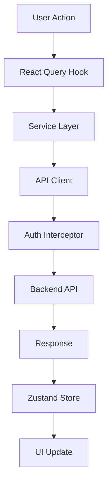

# 🏗️ **Storefront Codebase Overview**

## 📋 **Project Summary**

**Storefront** is a **Next.js 15+ App Router** application with **multi-tenant architecture**, featuring:

- **Zustand** for client-side state management (slice-based architecture)
- **React Query** for server state management and caching
- **OTP-based authentication** with tenant-aware API integration
- **Dynamic theming** per tenant
- **SEO optimization** with tenant-specific metadata
- **TypeScript** throughout for type safety

---

## 🗂️ **Directory Structure**

```
storefront/
├── 📁 app/                    # Next.js 15 App Router
│   ├── layout.tsx            # Root layout with providers
│   ├── page.tsx              # Home page
│   ├── globals.css           # Global styles
│   ├── robots.txt/           # Dynamic robots.txt
│   └── sitemap.xml/          # Dynamic sitemap
│
├── 📁 components/            # React components
│   ├── ui/                   # Reusable UI components
│   └── providers/            # Component-level providers
│
├── 📁 lib/                   # Core library code
│   ├── 📁 providers/         # App-level providers
│   ├── 📁 stores/            # Zustand state management
│   ├── 📁 hooks/             # Custom React hooks
│   ├── 📁 services/          # API service layer
│   ├── 📁 types/             # TypeScript type definitions
│   ├── 📁 config/            # Configuration files
│   └── 📄 *.ts               # Utility functions
│
├── 📁 config/                # Tenant configurations
│   └── 📁 tenants/           # Tenant-specific configs
│
├── 📁 docs/                  # Documentation (21 files)
├── 📁 scripts/               # Build/deployment scripts
└── 📄 Configuration files    # Next.js, TypeScript, etc.
```

---

## 🏛️ **Architecture Overview**

### **1. Multi-Tenant Architecture** 🏢

```typescript
// Tenant identification via subdomain
// abc-rentals.localhost:3000 → abc-rentals tenant
// xyz-cars.localhost:3000 → xyz-cars tenant

// Dynamic tenant configuration
const config = getTenantConfig(hostname)
// Returns tenant-specific: colors, branding, API endpoints, etc.
```

### **2. State Management Architecture** 🗃️

```typescript
// Zustand (Client State) + React Query (Server State)
┌─────────────────┐    ┌─────────────────┐
│   Zustand       │    │  React Query    │
│   (Client)      │    │   (Server)      │
├─────────────────┤    ├─────────────────┤
│ • Auth State    │    │ • API Caching   │
│ • User Profile  │    │ • Background    │
│ • UI State      │    │   Refetching    │
│ • Cart State    │    │ • Optimistic    │
│ • Settings      │    │   Updates       │
└─────────────────┘    └─────────────────┘
```

### **3. Service Layer Architecture** 🔧

```typescript
// Centralized API interaction
┌─────────────────┐
│   Components    │
└─────────┬───────┘
          │
┌─────────▼───────┐
│  React Query    │
│     Hooks       │
└─────────┬───────┘
          │
┌─────────▼───────┐
│   Services      │
│  (Auth, User,   │
│   Booking, etc.)│
└─────────┬───────┘
          │
┌─────────▼───────┐
│  API Client     │
│  (with tenant   │
│   context)      │
└─────────┬───────┘
          │
┌─────────▼───────┐
│   Backend API   │
└─────────────────┘
```

---

## 🔧 **Core Technologies**

### **Frontend Framework**

- **Next.js 15+** with App Router
- **React 18+** with Server Components
- **TypeScript** for type safety

### **State Management**

- **Zustand** - Client-side state (slice-based architecture)
- **React Query** - Server state management and caching
- **Context API** - Provider patterns for SSR compatibility

### **Styling**

- **Tailwind CSS v4** - Utility-first styling
- **CSS Custom Properties** - Dynamic tenant theming

### **Authentication**

- **OTP-based** authentication (mobile verification)
- **Cookie-based** session management (`authkey`)
- **Tenant-aware** API requests

### **Development Tools**

- **ESLint** - Code linting
- **Prettier** - Code formatting
- **Husky** - Git hooks
- **Jest** - Testing framework

---

## 🗃️ **State Management Deep Dive**

### **Zustand Store Structure** (Slice-Based)

```typescript
// lib/stores/store.ts
export const createAppStore = initialState => {
  return createStore<StoreState>()(
    persist(
      (set, get, api) => ({
        // Combine all slices
        ...createAuthSlice(set, get, api), // Auth state
        ...createUserSlice(set, get, api), // User profile
        // Future: ...createUISlice(), ...createCartSlice()
      }),
      {
        name: 'storefront-auth-store',
        partialize: state => ({
          // Only persist essential auth data
          authKey: state.authKey,
          userId: state.userId,
          isAuthenticated: state.isAuthenticated,
        }),
        skipHydration: true, // Manual hydration for SSR
      },
    ),
  )
}
```

### **Auth Slice** 🔐

```typescript
// lib/stores/slices/auth.slice.ts
export interface AuthState {
  // Core auth state
  authKey: string | null
  userId: string | null
  isAuthenticated: boolean

  // OTP flow state
  otpRequestId: string | null

  // Single loading state (consolidated)
  isLoading: boolean

  // Error state
  error: string | null

  // Actions
  setAuthData: (data: { authKey: string; userId: string }) => void
  setOtpRequestId: (requestId: string | null) => void
  setLoading: (isLoading: boolean) => void
  setError: (error: string | null) => void
  clearAuth: () => void
}
```

### **User Slice** 👤

```typescript
// lib/stores/slices/user.slice.ts
export interface UserState {
  // User profile state
  profile: User | null

  // Single loading state
  isLoading: boolean

  // Error state
  error: string | null

  // Actions
  setProfile: (profile: User) => void
  updateProfile: (profileData: Partial<User>) => void
  clearProfile: () => void
  setLoading: (isLoading: boolean) => void
  setError: (error: string | null) => void

  // Computed getters
  needsProfileCompletion: () => boolean
  hasValidProfile: () => boolean
}
```

---

## 🔗 **React Query Integration**

### **QueryClient Configuration**

```typescript
// lib/providers/QueryProvider.tsx
function createQueryClient() {
  return new QueryClient({
    defaultOptions: {
      queries: {
        refetchOnMount: false, // Better for SSR
        refetchOnWindowFocus: false, // Less aggressive
        staleTime: 5 * 60 * 1000, // 5 minutes
        gcTime: 10 * 60 * 1000, // 10 minutes
        retry: 1, // Simple retry
      },
    },
  })
}
```

### **Auth Hooks Pattern**

```typescript
// lib/services/hooks/auth-hooks.ts
export function useSendOtp() {
  const { setLoading, setOtpRequestId, setError } = useAuthActions()

  return useMutation({
    mutationFn: async ({ mobileNumber, languageCode }) => {
      // Host-consumer pattern: handle loading in mutationFn
      setLoading(true)
      setError(null)
      try {
        return await authService.sendOtp(mobileNumber, languageCode)
      } catch (error) {
        setError('Failed to send OTP')
        throw error
      } finally {
        setLoading(false)
      }
    },
    onSuccess: otpRequestId => {
      setOtpRequestId(otpRequestId)
      setError(null)
    },
  })
}
```

---

## 🏢 **Multi-Tenant System**

### **Tenant Configuration**

```typescript
// config/tenants/abc-rentals.json
{
  "id": "abc-rentals",
  "name": "InstaShop",
  "domain": "abc-rentals.localhost",
  "theme": {
    "primary": "#3B82F6",
    "secondary": "#1E40AF",
    "accent": "#F59E0B"
  },
  "api": {
    "baseUrl": "https://api.abc-rentals.com"
  },
  "metadata": {
    "title": "InstaShop - Premium Car Rental",
    "description": "Best car rental service in the city"
  }
}
```

### **Tenant Resolution**

```typescript
// lib/tenant.ts
export function getTenantConfig(hostname: string): TenantConfig {
  // Extract tenant ID from subdomain
  const tenantId = extractTenantId(hostname)

  // Load tenant-specific configuration
  const config = loadTenantConfig(tenantId)

  return config
}
```

### **Dynamic Theming**

```typescript
// lib/theme-utils.ts
export function generateThemeCSS(theme: ThemeConfig): string {
  return `
    :root {
      --color-primary: ${theme.primary};
      --color-secondary: ${theme.secondary};
      --color-accent: ${theme.accent};
    }
  `
}
```

---

## 🔐 **Authentication Flow**

### **OTP-Based Authentication**

```typescript
// 1. Send OTP
const { mutate: sendOtp } = useSendOtp()
sendOtp({ mobileNumber: '+1234567890' })

// 2. Verify OTP
const { mutate: verifyOtp } = useVerifyOtp()
verifyOtp({ otp: '123456' })

// 3. Store auth data in Zustand
setAuthData({ authKey: 'abc123', userId: 'user456' })

// 4. API requests include authkey cookie
// Automatically handled by auth interceptor
```

### **API Client with Auth**

```typescript
// lib/services/base/api-client.ts
export class ApiClient {
  async get<T>(url: string, config?: ApiConfig): Promise<T> {
    // Auth interceptor automatically adds authkey cookie
    const response = await this.request({
      ...config,
      url,
      method: HTTP_METHODS.GET,
    })
    return response.data
  }
}
```

---

## 🎨 **UI Component Architecture**

### **Provider Structure**

```typescript
// app/layout.tsx
export default function RootLayout({ children }) {
  return (
    <html>
      <body>
        <Providers>                    {/* Zustand + React Query */}
          <TenantProvider>             {/* Multi-tenant context */}
            <ThemeProvider>            {/* Dynamic theming */}
              {children}
            </ThemeProvider>
          </TenantProvider>
        </Providers>
      </body>
    </html>
  )
}
```

### **Component Patterns**

```typescript
// Server Component (default)
export default function HomePage() {
  const config = getTenantConfig() // Server-side tenant resolution

  return (
    <div>
      <h1>{config.name}</h1>
      <ClientComponent /> {/* Client component for interactivity */}
    </div>
  )
}

// Client Component
'use client'
export function ClientComponent() {
  const { isLoading, user } = useAuth() // Zustand + React Query

  if (isLoading) return <Spinner />

  return <div>Welcome, {user?.name}!</div>
}
```

---

## 🚀 **Key Features**

### **1. SSR/SSG Compatible** ⚡

- **Server Components** by default
- **Client Components** only when needed
- **Manual hydration** for Zustand stores
- **SSR-safe** API client

### **2. Multi-Tenant Ready** 🏢

- **Subdomain-based** tenant identification
- **Dynamic configuration** loading
- **Tenant-aware** API requests
- **Custom theming** per tenant

### **3. Type-Safe Throughout** 🔒

- **Full TypeScript** implementation
- **Shared interfaces** across modules
- **Zod schemas** for validation
- **Strict type checking**

### **4. Performance Optimized** ⚡

- **React Query** caching and background updates
- **Zustand** minimal re-renders
- **Code splitting** with Next.js
- **Optimized bundle** size

### **5. Developer Experience** 👨‍💻

- **Hot reloading** with Next.js
- **TypeScript** IntelliSense
- **ESLint + Prettier** formatting
- **Comprehensive documentation**

---

## 📚 **Documentation Structure**

```
docs/
├── 📄 README.md                           # Main documentation index
├── 📄 project-structure.md                # Detailed folder structure
├── 📄 project-structure-diagram.md        # Visual architecture diagrams
├── 📄 services-tenant-context.md          # Multi-tenant system guide
├── 📄 state-management-zustand-plan.md    # Zustand integration plan
├── 📄 zustand-implementation-guide.md     # Implementation steps
├── 📄 zustand-ssr-ssg-patterns.md         # SSR/SSG patterns
├── 📄 zustand-minimal-setup.md            # Minimal setup guide
├── 📄 react-query-zustand-integration.md  # Integration guide
├── 📄 zustand-slice-architecture-refactor.md # Architecture refactor
├── 📄 react-query-integration-comparison.md # Host-consumer analysis
├── 📄 consolidated-loading-states-benefits.md # Loading state benefits
└── 📄 codebase-overview.md                # This file
```

---

## 🎯 **Getting Started**

### **1. Development Setup**

```bash
npm install
npm run dev
```

### **2. Multi-Tenant Testing**

```bash
# Test different tenants
abc-rentals.localhost:3000
xyz-cars.localhost:3000
test-rental.localhost:3000
```

### **3. Key Files to Understand**

- `app/layout.tsx` - Root layout and providers
- `lib/stores/store.ts` - Zustand store factory
- `lib/services/hooks/auth-hooks.ts` - React Query auth hooks
- `lib/tenant.ts` - Multi-tenant configuration
- `middleware.ts` - Tenant resolution middleware

### **4. Architecture Patterns**

- **Slice-based Zustand** - Modular state management
- **Host-consumer pattern** - Simplified React Query integration
- **Consolidated loading states** - Single loading state per domain
- **Server-first components** - SSR/SSG optimization

---

## 🔄 **Data Flow**



---

## 🎉 **Summary**

The **Storefront** codebase is a **modern, scalable, multi-tenant** Next.js application that demonstrates:

1. **✅ Best Practices** - TypeScript, testing, documentation
2. **✅ Modern Architecture** - App Router, Server Components, slice-based state
3. **✅ Performance** - React Query caching, optimized bundles
4. **✅ Developer Experience** - Hot reloading, type safety, comprehensive docs
5. **✅ Scalability** - Multi-tenant, modular architecture
6. **✅ Maintainability** - Clean separation of concerns, consistent patterns

The architecture follows **proven patterns from host-consumer-website** while being specifically designed for **multi-tenant e-commerce** scenarios! 🚀✨
